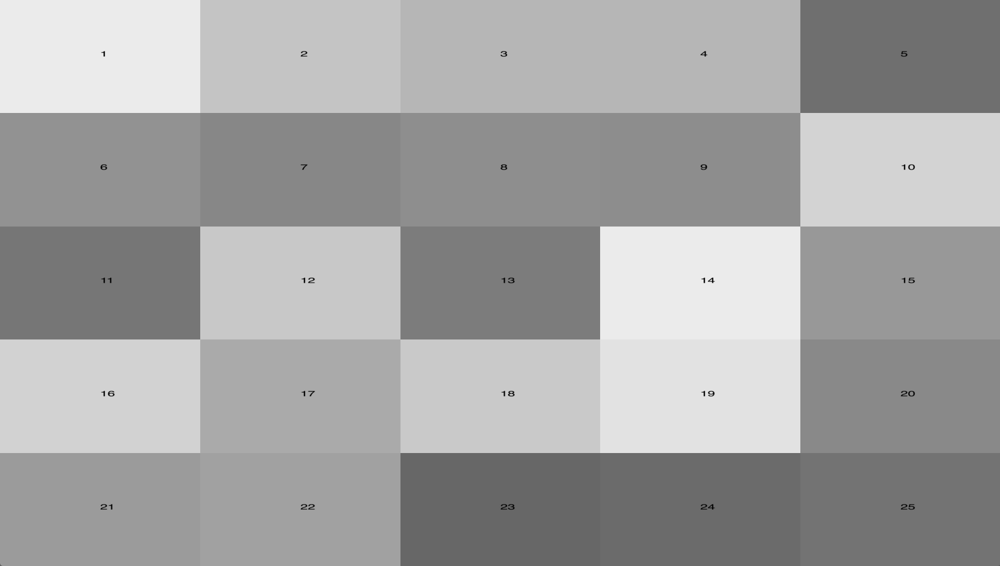
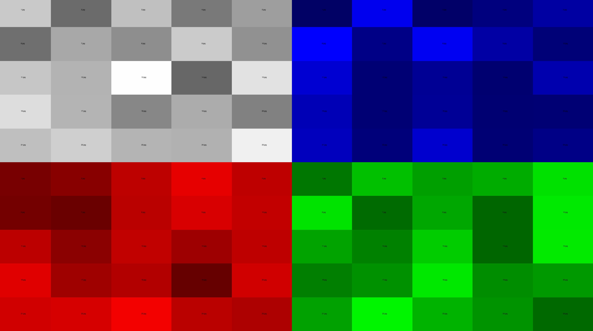

# 5X5
### A tool for easily assembling 5x5 grids for MCAD Network & Archive Class

#### Install:
  1. Click the .zip download button in the upper right hand corner of this page.
  1. Unzip the file.

#### Single 5x5 Use:
  1. navigate to the `single` folder
  1. Open the `index.html` with your web browser to view the images, it is best to maintain a consistent aspect ratio/orientation across all images ie. all vertical, all horizontal, or all square.
  1. Open the `images` folder and replace `1.jpg, 2.jpg, 3.jpg, 4.jpg, 5.jpg, 6.jpg, 7.jpg, etc.` with your own large .jpg images  
  1. Open the `thumbs` folder and replace `1.jpg, 2.jpg, 3.jpg, 4.jpg, 5.jpg` with your own small thumbnail .jpg images.
  1. refresh the `index.html` page in your browser to see your images appear.
  1. As you progress you will want this page to load faster, consider re-sizing your images to a maximum of 1500px in one direction.

#### (4x)5x5(100) Use:
  1. navigate to the `multi` folder
  1. Open the `index.html` with your web browser to view the images, it is best to maintain a consistent aspect ratio/orientation across all images ie. all vertical, all horizontal, or all square.
  1. keep in mind the following: tr = top right, tl = top left, br = bottom right, bl = bottom left
  1. Open the `images_tr`, `images_tl`, `images_br`, `images_bl` folders and replace `1.jpg, 2.jpg, 3.jpg, 4.jpg, 5.jpg, 6.jpg, 7.jpg, etc.` with your own large .jpg images.
  1. Open the `thumbs_tr`, `thumbs_tl`, `thumbs_br`, `thumbs_bl` folders and replace `1.jpg, 2.jpg, 3.jpg, 4.jpg, 5.jpg, 6.jpg, 7.jpg, etc.` with your own large .jpg images.
  1. refresh the `index.html` page in your browser to see your images appear.

### Orientation of the grid to filenames `1.jpg, 2.jpg, 3.jpg, etc.`
Single version

Multi Version

